# Credit Card Fraud Detection
## Context
https://www.kaggle.com/datasets/mlg-ulb/creditcardfraud

It is important that credit card companies are able to recognize fraudulent credit card transactions so that customers are not charged for items that they did not purchase.

## Setup
### Environment
- Install conda environment (preferred): ```conda env create -f environment.yml```   
Name of the environment: pylearn    

- Install with pip (alternative): ```pip install -r requirements.txt```
### Data
Put the data CSV file of interest in the ```Credit-Card-Fraud-Detection``` repository, naming it ```creditcard.csv```.   
Alternatively, change the INPUT_DATA_PATH parameter in both ```train.py``` and ```predict.py``` into a path more suitable for you.
## Task
### Code Structure
The main files are ```train.py``` and ```predict.py```. They can be personalized with the global parameters at the beginning of these two.   
The first one, having as input the data, it explores them, it preprocesses them and split them into train and set data (80%-20%). Then it trains some classifiers and evaluates them, with the metrics stored in ```utils.py``` file.
Optionally it gives as output also the confusion matrices (by default no) and the pickle file of the best classifier (by default no).
The default configurations are those that create the best classifier found out.      
The second file instead is designed to be as concise as possible, so by default there aren't print in stdout. Having as input the data and the pickle of the best model trained in ```train.py```, it evaluates it and it computes the metrics and the confusion matrix optionally (by default no), and it gives as output a csv file with the predictions (by default yes).  By default it doesn't split the data in entrance.  
The ```final_model.pickle``` file encloses the best classifier found, while the ```prediction.csv``` file is a list of all the predictions of the test set of the given data, split in the same way of the ```train.py```, and so is the final output.
### Data Exploration
The first data analyses tell that the samples are a lot (284807) and that the features are 30: time, amount and the other ones, obtained by performing a PCA on the original features for privacy reasons.    
Then there is one more column that represents the class, 0 for a non-fraudolent transaction and 1 for a fraudolent one.    
There aren't null samples and there aren't outliers due to errors of of some kind.   
But the data are very umbalanced, since only 0.17% of the samples are about fraudolent transactions.   
On what concerns features correlation, as shown in the following image, there is no notable correlation between features V1-V28. There are certain correlations between some of these features and Time (inverse correlation with V3) and Amount (direct correlation with V7 and V20, inverse correlation with V1 and V5).

<p align="center">
 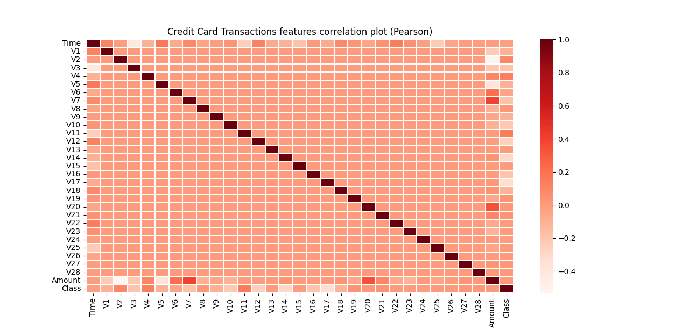
</p>

Then, the features density shown in the following image indicates a good selectivity in terms of distribution for the two values of Class; only V15, V24, V25, V26 have similar profiles for the two values of Class.   
In general, with just few exceptions (Time and Amount), the features distribution for legitimate transactions (values of Class = 0) is centered around 0, sometime with a long queue at one of the extremities. At the same time, the fraudulent transactions (values of Class = 1) have a skewed (asymmetric) distribution.

<p align="center">
 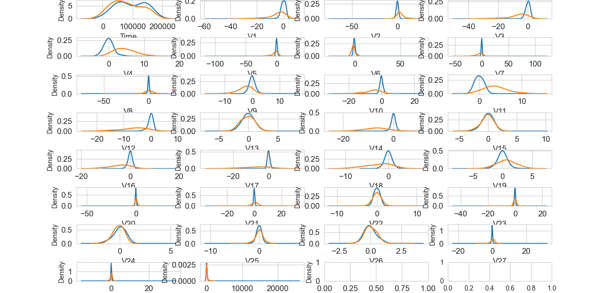
</p>

It has also been made a study about the disposition of the training samples of the Class 0 in the feature space. Subsequent iterations with diffent ks of the K-means algorithm, with the use of the silhoutte score, have obtained so and have generated the following image.   
The idea was to find a best cluster of training samples of the majority class, in order to divide the samples accordingly and so to create a sort of targeted undersampling, and then to try training the classifiers with this different sumbsamples and at the end ensemble the results with a majority voting.   
But from the analysis it can be seen that none of the ks stand out, so this idea never caught on, but for sure if there are more time and resources other cluster algorithms can be tried.

<p align="center">
 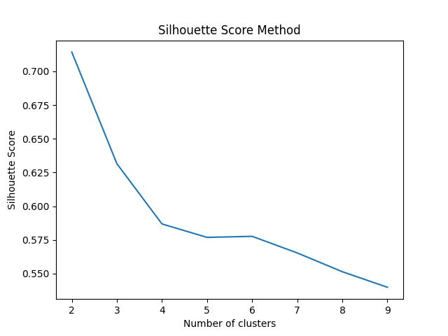
</p>

## Data Preprocessing
Since features V15 and v26 have very similar profiles for the two values of Class, removing them only improves predictions.   
And also, because all the features aside Time and Amount are scaled and centered, it is a very good idea scaling also those 2.     
Other preprocessing techniques like outliers removal, PCA, TSVD and different kind of upsampling, downsampling and updownsampling (upsampling with data cleaning) don't lead to meaningful improvements


## Classifier Choice
### Baseline
Since the data are so umbalanced, there is the need to be very careful with the classification metrics, so aside of the classic accuracy_score, and roc_auc_score, the more meaningful one is the average_precision_score.   
Here it is the baseline using a Random classifier:
<p align="center">
 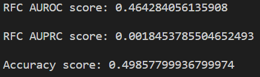
</p>
<p align="center">
 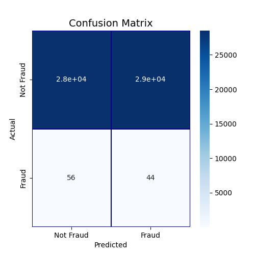
</p>
And since the majority class is the 0 one, here it is the baseline using a Naive classifier that predicts always 0:  
<p align="center">
 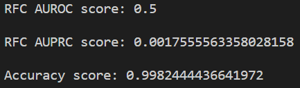
</p>
<p align="center">
 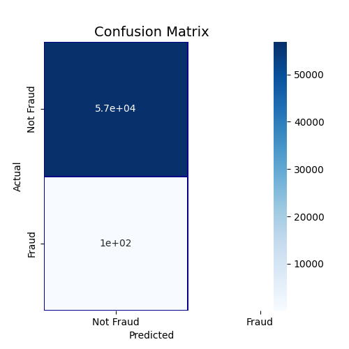
</p>

### Best Classifiers
After trying a lot of classifiers and sampling strategies, CatBoostClassifier has proven to be the better one, and with 56862 test samples it makes only 20 FN and 2 FP:
<p align="center">
 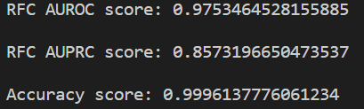
</p>
<p align="center">
 
</p>
The second best is the XGBClassifier, with 20 FN and 3 FP 

### Final Model
To find the best final model, so the best ensemble of the most performing classifiers, it has been calculated the intersection of the wrong predictions between the CatBoostClassifier and the others. Obviously the lesser the better, because in this way every classifier learns different aspects of the data, and can contribute more effectively. Here they are the results:
<p align="center">
 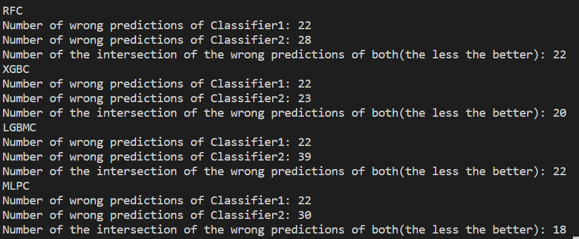
</p>

Both XGBClassifier and MLPClassifier have a decent intersection with the CatBoostClassifier, but since MLPClassifier is more prone to errors, the final ensemble is the fusion between the CatBoostClassifier and XGBClassifier, and those are the final results:
<p align="center">
 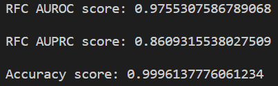
</p>
<p align="center">
 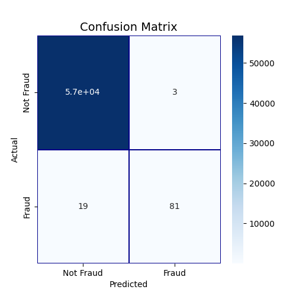
</p>

## Deployment Strategy
To query the trained model real-time, the first step is packaging and optimizing the trained model, and that was done with the help of pickle.     
If the objective is an online deployment, maybe on the site, there is the need of an appropriate environment to guarantee the success.
For this purpose it can be used the Spring Web framework.    
If the objective is a scenario where there are a lot of requests with maybe discontinuous peaks, the best way is to use asynchronous APIs to guarantee a cleverer use of resources, or if there aren't so many, simpler synchronous APIs are enough. Or GraphQL can be used if there is the need of more control and flexibility about the data exchanged with the transactions.    
In any case the most important thing is to guarantee horizontal scalability in order to process all requests, don't make customers unhappy, and obtain a higher profit.    
If the cloud environment of Spring with Docker containers is not enough, there is the possibility to also integrate it with Kubernetes.
Another aspect very important is logging and traceability, because in this way if something goes wrong, it's a lot easier to determine the cause.    
If the data to classify are pure and not masked by a previous PCA as in this case, even the security is very important, and a TLS connection is a must (but also in general is a very good practice).
